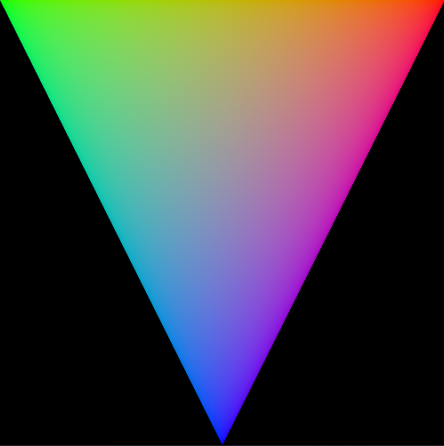
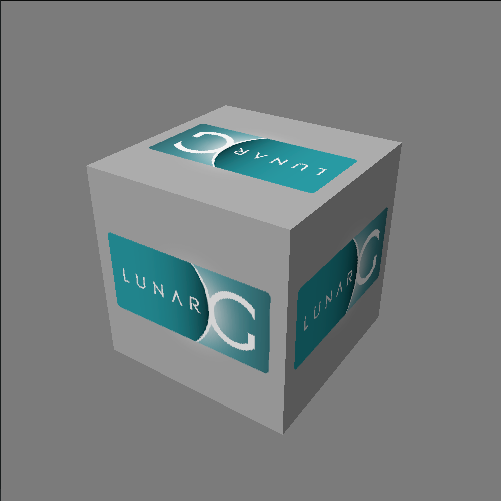

# Gravity Applications

## Gravity Triangle

This is the "beginning to use Vulkan" example.  Or, more
realistically, "beginning to use Gravity" example.

It renders an indexed colored triangle with the MVP matrix
passed in via a uniform buffer.

## Gravity Cube

This is a translation of the LunarG Cube example ported
into the Lunar Gravity framework.
