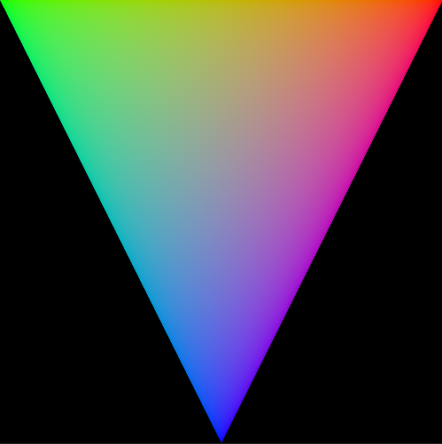
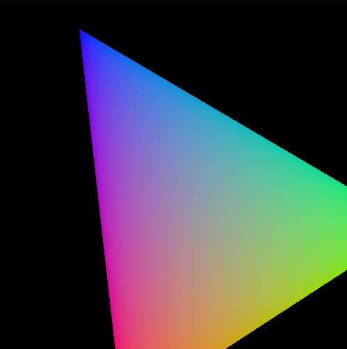
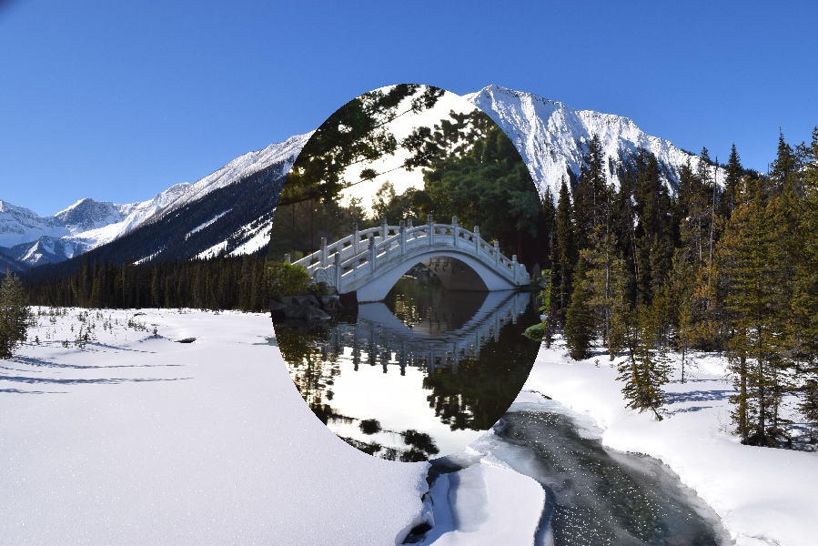

# LunarGlobe Applications

## 01 - Triangle

This is the "beginning to use Vulkan" example.
Or, more realistically, "beginning to use LunarGlobe" example.

It renders an indexed colored triangle with the MVP matrix
passed in via a uniform buffer.

## 02 - Dynamic Uniform Buffer

Building on top of the above triangle example, I added
the ability to spin the triangle around the Y-axis.
This is done by utilizing a dynamic uniform buffer
object and updating the offset before each draw to point
to an updated matrix.

Also, this is the first example to use GLM.

## 03 - Multi-Texture

Building on the dynamic uniform test, I added the ability
to sample from two textures.
Also, instead of passing in the matrix every frame, pass
in a position for an ellipse.
The shader then tests the ellipse position versus the
incoming texture coordinates.
If the texture coordinates are within the ellipse, then
the shader samples from the second texture.
Otherwise, the shader samples the first texture.

## LunarGlobe Cube

This is a translation of the
[LunarG Cube demo](https://github.com/KhronosGroup/Vulkan-Tools/blob/master/cube/cube.c)
ported into the LunarGlobe framework.
