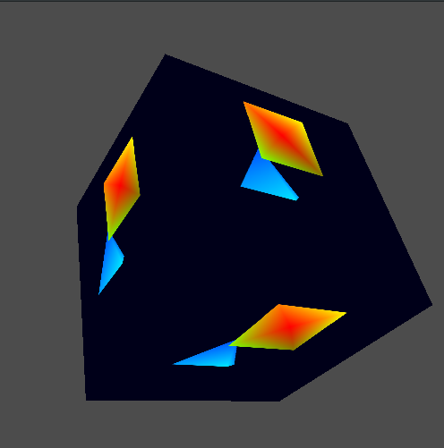

# LunarGlobe Samples

## 01 - Triangle

This is the "beginning to use Vulkan" example.
Or, more realistically, "beginning to use LunarGlobe" example.

It renders an indexed colored triangle with the MVP matrix
passed in via a uniform buffer.

Shader(s) used:
 * position_color ([vert](../resources/shaders/source/position_color_glsl.vert) / [frag](../resources/shaders/source/position_color_glsl.frag))

## 02 - Dynamic Uniform Buffer

Building on top of the above triangle example, I added
the ability to spin the triangle around the Y-axis.
This is done by utilizing a dynamic uniform buffer
object and updating the offset before each draw to point
to an updated matrix.

Also, this is the first example to use GLM.

Shader(s) used:
 * position_color ([vert](../resources/shaders/source/position_color_glsl.vert) / [frag](../resources/shaders/source/position_color_glsl.frag))

## 03 - Multi-Texture

Building on the dynamic uniform app, I added the ability
to sample from two textures.
Also, instead of passing in the matrix every frame, pass
in a position for an ellipse.
The shader then tests the ellipse position versus the
incoming texture coordinates.
If the texture coordinates are within the ellipse, then
the shader samples from the second texture.
Otherwise, the shader samples the first texture.

Shader(s) used:
 * position_multi_texture_ellipse ([vert](../resources/shaders/source/position_multi_texture_ellipse_glsl.vert) / [frag](../resources/shaders/source/position_multi_texture_ellipse_glsl.frag))

Texture(s) used:
 * [cks_memorial_taipei_pond.jpg](../resources/textures/cks_memorial_taipei_pond.jpg)
 * [kootney_winter_stream.jpg](../resources/textures/kootney_winter_stream.jpg)

## 04 - Push Constants

Building on the multi-texture app, I added the ability
to control what's going on in the shader using 3 push constants.
The first push constant is an integer value which is used to
indicate what behavior the shader should perform when sampling
from the two textures.
The second push constant defines the X radius of the
ellipse.
The third push constant defines the Y radius of the
ellipse.

Shader(s) used:
 * position_multi_texture_ellipse_pushconst ([vert](../resources/shaders/source/position_multi_texture_ellipse_pushconst_glsl.vert) / [frag](../resources/shaders/source/position_multi_texture_ellipse_pushconst_glsl.frag))

Texture(s) used:
 * [cks_memorial_taipei_pond.jpg](../resources/textures/cks_memorial_taipei_pond.jpg)
 * [kootney_winter_stream.jpg](../resources/textures/kootney_winter_stream.jpg)

## 05 - Simple GLM

Stepping back, I wanted to setup a simple sample which
used GLM to setup and move a camera and objects.

The sample does the following:
 * Use a camera (defined as position and orientation) to
   generate both a projection and view matrix.
 * Define multiple objects in a single vertex and index
   list.
 * Use a dynamic uniform buffer to pass along the camera
   projection and view matrices to the shader.
 * Use push constants to define the current model matrix.

Shader(s) used:
 * position_mvp_color ([vert](../resources/shaders/source/position_mvp_color_glsl.vert) / [frag](../resources/shaders/source/position_mvp_color_glsl.frag))

## 06 - Offscreen Rendering

Taking sample 05 "Simple GLM" as a starting point, I
expanded it to include offscreen rendering.
I rendered the previous scene into an offscreen color
and depth buffer.
The I took the offscreen color target and used it as
a texture to render onto the faces of a spinning cube.
I provide a separate uniform buffer for on-screen and
offscreen targets.

The sample does the following:
 * Use a camera (defined as position and orientation) to
   generate both a projection and view matrix.
 * Define multiple objects in a single vertex and index
   list.
 * Use a dynamic uniform buffer to pass along the camera
   projection and view matrices to the shader.
 * Use push constants to define the current model matrix.

Shader(s) used:
 * Offscreen view
   * position_mvp_color ([vert](../resources/shaders/source/position_mvp_color_glsl.vert) / [frag](../resources/shaders/source/position_mvp_color_glsl.frag))
 * Onscreen view
   * position_mvp_texture ([vert](../resources/shaders/source/position_mvp_texture_glsl.vert) / [frag](../resources/shaders/source/position_mvp_texture_glsl.frag))